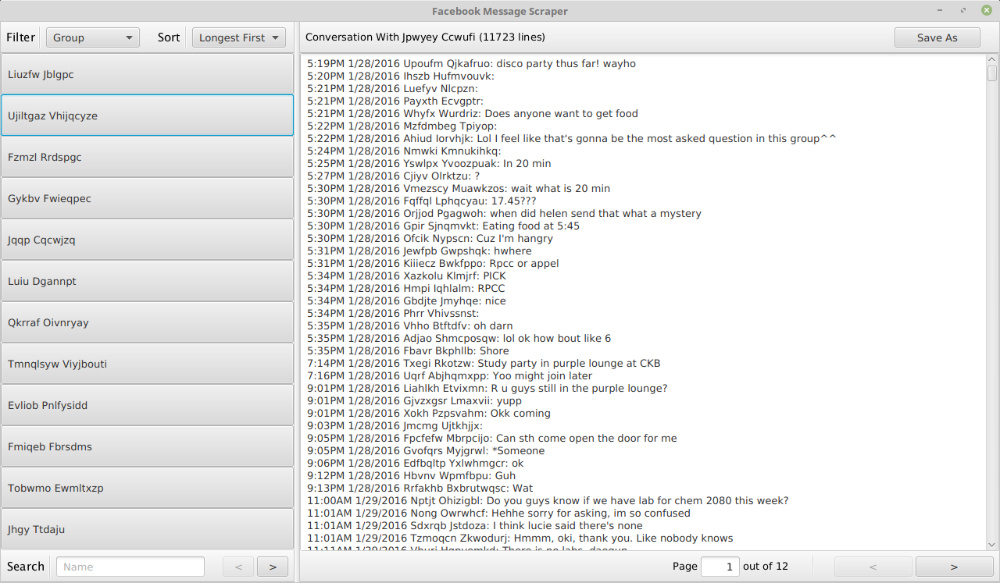

## Facebook Message Scraper

JavaFX-based program for parsing Facebook data archives. Allows you to easily access, read,
and count old messages and conversations (without having to deal with Messenger lag). Also
supports writing conversations to text file.

### Screenshot

### Features

- Sort threads by start date or length
- Filter group or private messages
- Search for threads with a specific person
- View the total number of messages (in lines) exchanged
- Revisit threads from the very beginning
- Export threads directly to text files

### Directions

Facebook allows users to download an archive of all of their
personal messages, including their old messages. To download
your data archive, go to Facebook -> Settings. Under the
General Account Settings, underneath all of the fields, there
should be a small link that says `Download a copy of your Facebook data`.

Follow the subsequent directions, and you should have a
`facebook-<USERNAME>.zip` file. Unzip it and you'll find your
`messages.htm` file in the `html` folder.

After you open up this program, it will prompt you to select 
the proper `messages.htm` file. Just point it to the file you
found in the above paragraph, wait a bit, and you should be good
to go!

### Download

If you're unfamiliar with git or Github, a direct download is
available from DropBox at [this link](https://www.dropbox.com/s/mttd8ryh7wjji8m/facebook-message-scraper.jar?dl=0).

Otherwise, you can clone the repo: the .jar file is located in the build/libs directory,
or you can call `gradle jar` to build it yourself.

### Usage

`java -jar facebook-message-scraper.jar`

Double-clicking the .jar file should also work.

### Issues

JavaFX can be a little laggy when dealing with extremely large strings. I'm considering
adding paging to long threads, but so far the lag is manageable up to about
50,000 messages. Saving to file and using a more robust text editor is probably
your best bet for anything large.
