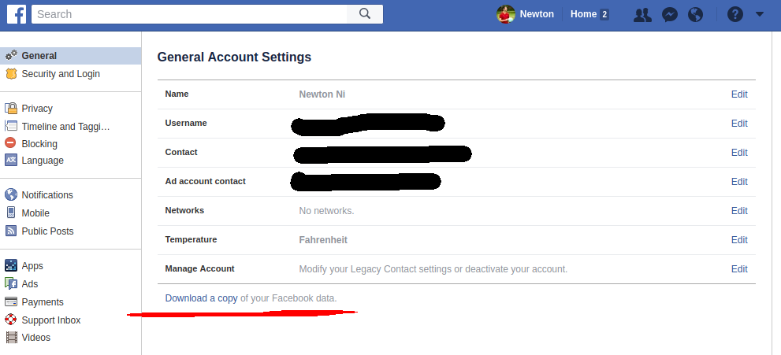

## Facebook Message Scraper

JavaFX-based program for parsing Facebook data archives. Allows you to easily access, read,
and count old messages and conversations (without having to deal with Messenger lag). Also
supports writing conversations to text file.

### Screenshot

### Features

- Sort threads by start date, length, or alphabetically
- Filter group or private messages
- Search for threads with a specific person
- View the total number of messages (in lines) exchanged
- Revisit threads from the very beginning
- Export threads directly to text files

### Setup

Facebook allows users to download an archive of all of their
personal messages, including their old messages. To download
your data archive, go to Facebook -> Settings. Under the
General Account Settings, underneath all of the fields, there
should be a small link that says `Download a copy of your Facebook data`.

Follow the subsequent directions, and you should have a
`facebook-<USERNAME>.zip` file. Unzip it and you'll find your
`messages.htm` file in the `html` folder.

Download the program (facebook-message-scraper.jar) and open by following the
directions below.

### Download

If you're unfamiliar with git or Github, a direct download is
available from DropBox at [this link](https://www.dropbox.com/s/mttd8ryh7wjji8m/facebook-message-scraper.jar?dl=0).

Otherwise, you can clone the repo: the .jar file is located in the build/libs directory,
or you can call `gradle jar` to build it yourself.

### Usage

`java -jar facebook-message-scraper.jar`

Double-clicking the .jar file should also work.

After double-clicking, a file selector will immediately pop up. Choose
the `messages.htm` file you downloaded in the **Setup** step, and the
program will begin sorting through your messages. This might take
a minute or two, but after that you should be all set.

### Issues

Right now, each message is its own Java object, which can eat up RAM
fairly quickly. If the program crashes after selecing the file but
before the GUI appears, Java probably ran out of memory. To fix this,
you can launch Java with command-line arguments to allow more RAM usage:

`java -jar -Xmx1024m facebook-message-scraper.jar`

So far this hasn't been an issue for most people.
